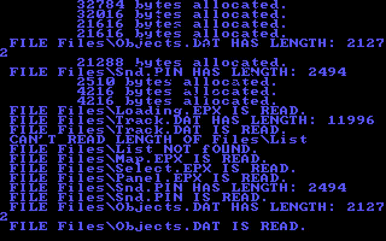

# Hard-Drivin
Just compiled x86 DOS Hard Drivin' with an external gfx lib 
since the original one was missing 
 
* audio works
* interface works
* collisions work
* physics work
* cpu cars work
* replays work
* ghost car works
 
Notice a bit lacking hidden surface removal. 
 
Since Hard Drivin' II runs on the same engine, 
albeit with some fixes & adjustments, 
this also works with tracks from HD2 & editor 
after they are renamed to 'TRACK.DAT'
